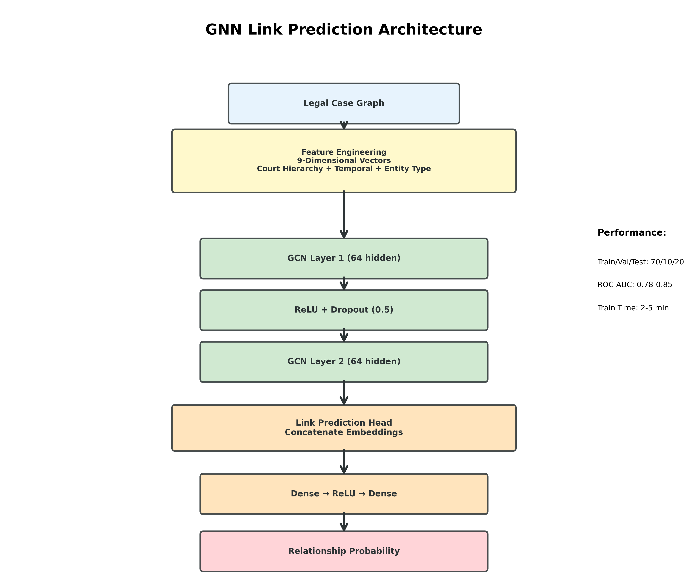

# GNN Architecture Explained - LegalNexus

## 📊 Architecture Diagram Overview



---

## 🔬 What Each Layer Does (Step-by-Step)

### **Layer 1: Legal Case Graph (Input)**

**What it is:**
- Your Neo4j knowledge graph with Cases, Judges, Courts, and Statutes

**In your code:**
```python
# From Neo4j database
nodes_query = """
MATCH (n)
RETURN id(n) as node_id, labels(n) as labels, 
       n.title as title, n.court as court, n.date as date
"""
nodes_data = self.graph.query(nodes_query)
```

**What happens:**
- Extracts all nodes (cases, judges, courts, statutes) from Neo4j
- Extracts all relationships (JUDGED, HEARD_BY, REFERENCES, CITES)

---

### **Layer 2: Feature Engineering (9-Dimensional Vectors)**

**What it is:**
- Converts legal entities into numerical vectors that the neural network can understand

**The 9 Features:**

| Feature Index | What It Represents | Example Value |
|--------------|-------------------|---------------|
| 0-3 | **Node Type** (one-hot encoded) | Case: [1,0,0,0]<br>Judge: [0,1,0,0] |
| 4 | **Title Length** (normalized) | "State v. Kumar" → 0.14 |
| 5-7 | **Court Hierarchy** | Supreme Court: [1,0,0]<br>High Court: [0,1,0]<br>District: [0,0,1] |
| 8 | **Year** (normalized 1950-2020) | 2010 → 0.86 |

**In your code:**
```python
def create_node_features(self, nodes_data):
    # 1. Node type (4 features)
    type_features = [0, 0, 0, 0]  # Case, Judge, Court, Statute
    if node_type == 'Case':
        type_features[0] = 1
    
    # 2. Title length (1 feature)
    feature_vector.append(len(title) / 100)
    
    # 3. Court hierarchy (3 features)
    court_features = [0, 0, 0]  # SC, HC, Other
    if 'supreme' in court.lower():
        court_features[0] = 1
    
    # 4. Year (1 feature)
    normalized_year = (year - 1950) / 70
```

**Why this matters:**
- Encodes Indian legal system hierarchy (Supreme Court > High Court > District Court)
- Captures temporal evolution of legal precedents
- Distinguishes different entity types

---

### **Layer 3: GCN Layer 1 (Graph Convolutional Network)**

**What it is:**
- A neural network layer that learns from graph structure
- Transforms 9 input features → 64 hidden features

**How GCN works:**
1. **For each node**, look at its neighbors in the graph
2. **Aggregate** information from connected nodes
3. **Transform** using learnable weights
4. **Output** a new representation (embedding)

**The Math (simplified):**
```
For node "Case_123":
- Look at connected Judge, Court, Statute nodes
- Combine their features with Case_123's own features
- Apply learned transformation: h = W × (aggregated_features)
- Output: 64-dimensional vector
```

**In your code:**
```python
# First GCN layer
self.convs.append(GCNConv(num_features=9, hidden_dim=64))

# During forward pass
x = conv(x, edge_index)  # edge_index tells which nodes are connected
```

**Example:**
```
Input:  Case_123 with 9 features [1,0,0,0, 0.5, 1,0,0, 0.8]
        + Info from connected Judge, Court, Statute
        
GCN:    Learns to combine these features
        
Output: 64-dimensional embedding that captures:
        - What type of entity it is
        - Its position in court hierarchy  
        - Its connections to other entities
        - Temporal context
```

---

### **Layer 4: ReLU + Dropout (0.5)**

#### **ReLU (Rectified Linear Unit)**

**What it is:**
- An activation function that adds non-linearity

**The Math:**
```
ReLU(x) = max(0, x)

Examples:
  ReLU(5) = 5      (positive stays positive)
  ReLU(-3) = 0     (negative becomes 0)
  ReLU(0) = 0      (zero stays zero)
```

**Why we need it:**
- Without ReLU, the neural network would just be a linear transformation (boring!)
- ReLU allows the network to learn complex patterns
- It introduces non-linearity so the network can learn "if this AND that, then..."

**In your code:**
```python
x = F.relu(x)  # Apply ReLU activation
```

**Visual example:**
```
Before ReLU: [-2.5, 3.7, -1.2, 5.3, 0.8, -0.5]
After ReLU:  [0,    3.7, 0,    5.3, 0.8, 0   ]
             ↑           ↑                ↑
          Negatives become zero, positives unchanged
```

#### **Dropout (0.5)**

**What it is:**
- Randomly "turns off" 50% of neurons during training

**Why we need it:**
- Prevents overfitting (memorizing training data)
- Forces the network to learn robust features
- Like studying with practice tests instead of just memorizing answers

**In your code:**
```python
self.dropout = nn.Dropout(0.5)
x = self.dropout(x)  # Randomly zero out 50% of values
```

**Example:**
```
Before Dropout: [3.7, 5.3, 2.1, 4.8, 1.9, 3.2]
After Dropout:  [0,   5.3, 0,   4.8, 0,   3.2]  (50% randomly zeroed)
```

---

### **Layer 5: GCN Layer 2 (64 hidden)**

**What it is:**
- Second graph convolutional layer
- Takes 64-dim input → outputs 64-dim embedding

**How it's different from Layer 1:**
- Now works with richer 64-dim representations (not raw 9 features)
- Can learn higher-level patterns
- Looks at 2-hop neighbors (neighbors of neighbors)

**In your code:**
```python
# Second GCN layer
self.convs.append(GCNConv(hidden_dim=64, hidden_dim=64))

# Forward pass
for i, conv in enumerate(self.convs):
    x = conv(x, edge_index)
    if i < len(self.convs) - 1:  # Don't apply ReLU after last layer
        x = F.relu(x)
        x = self.dropout(x)
```

**What the network learns:**
```
Layer 1: "This is a Case node from Supreme Court in 2010"
Layer 2: "This Case cites other Cases from similar courts and time periods"
         (Higher-level relationships and patterns)
```

---

### **Layer 6: Link Prediction Head (Concatenate Embeddings)**

**What it is:**
- Takes embeddings from two nodes and combines them
- Prepares data for predicting if they should be connected

**How it works:**
1. **Get embeddings** for source node (e.g., Case A)
2. **Get embeddings** for target node (e.g., Case B)
3. **Concatenate** them side-by-side → 128-dimensional vector (64 + 64)

**In your code:**
```python
# Get embeddings for both nodes in a potential relationship
source_embeddings = x[edge_pairs[0]]  # Case A: [64 features]
target_embeddings = x[edge_pairs[1]]  # Case B: [64 features]

# Concatenate: put them side by side
link_embeddings = torch.cat([source_embeddings, target_embeddings], dim=1)
# Result: [128 features] = [Case A features | Case B features]
```

**Example:**
```
Case A embedding:     [0.5, 0.3, 0.8, ..., 0.2]  (64 numbers)
                      +
Case B embedding:     [0.7, 0.1, 0.9, ..., 0.4]  (64 numbers)
                      ↓
Concatenated:        [0.5, 0.3, 0.8, ..., 0.2, | 0.7, 0.1, 0.9, ..., 0.4]
                     ↑                          ↑
                     Case A                     Case B
                     (128 numbers total)
```

---

### **Layer 7: Dense → ReLU → Dense**

**What it is:**
- Multi-layer perceptron (MLP) that learns to predict relationships

**The layers:**

1. **Dense (128 → 64)**: Compress 128 features to 64
2. **ReLU**: Add non-linearity
3. **Dropout (0.5)**: Prevent overfitting  
4. **Dense (64 → 1)**: Compress to single score
5. **Sigmoid**: Convert to probability (0 to 1)

**In your code:**
```python
self.link_predictor = nn.Sequential(
    nn.Linear(hidden_dim * 2, hidden_dim),    # 128 → 64
    nn.ReLU(),                                 # Activation
    nn.Dropout(0.5),                           # Regularization
    nn.Linear(hidden_dim, 1),                  # 64 → 1
    nn.Sigmoid()                               # 0-1 probability
)
```

**Step-by-step transformation:**
```
Input (concatenated):     [128 features]
                         ↓
Dense (128→64):          [64 features]
                         ↓
ReLU:                    [64 features] (negatives → 0)
                         ↓
Dropout:                 [64 features] (50% zeroed)
                         ↓
Dense (64→1):            [1 number] (e.g., 2.3)
                         ↓
Sigmoid:                 [0.91] (probability)
```

**Sigmoid function:**
```
Sigmoid(x) = 1 / (1 + e^(-x))

Examples:
  Sigmoid(2.3) = 0.91    → 91% chance of relationship
  Sigmoid(0)   = 0.50    → 50% chance (uncertain)
  Sigmoid(-2.3) = 0.09   → 9% chance (unlikely)
```

---

### **Layer 8: Relationship Probability (Output)**

**What it is:**
- Final probability that two nodes should be connected

**Output range:** 0.0 to 1.0
- **0.0** = Definitely NO relationship
- **0.5** = Uncertain
- **1.0** = Definitely YES relationship

**In your code:**
```python
link_probs = self.link_predictor(link_embeddings)
return link_probs.squeeze()  # Remove extra dimensions
```

**Real examples from your system:**
```
Case A → Case B:     Probability 0.85  → Likely CITES relationship
Case X → Judge Y:    Probability 0.92  → Likely JUDGED relationship
Case M → Statute N:  Probability 0.15  → Unlikely REFERENCES relationship
```

---

## 🎯 Complete Flow Example

Let's trace a real prediction through your network:

### **Scenario: Does "Case_123" cite "Case_456"?**

```
Step 1: INPUT
━━━━━━━━━━━━━━━━━━━━━━━━━━━━━━━━━━━━━━━━━━━━━━━━━━━━━━━━━━━━━━━━━━━
Graph has:
- Case_123: Supreme Court, 2010, title length 50 chars
- Case_456: High Court, 2005, title length 30 chars
- Existing connections to judges, courts, statutes

Step 2: FEATURE ENGINEERING
━━━━━━━━━━━━━━━━━━━━━━━━━━━━━━━━━━━━━━━━━━━━━━━━━━━━━━━━━━━━━━━━━━━
Case_123 → [1, 0, 0, 0,  0.5,  1, 0, 0,  0.86]
            ↑           ↑     ↑         ↑
            Case type   Title SC        Year 2010
            
Case_456 → [1, 0, 0, 0,  0.3,  0, 1, 0,  0.79]
            ↑           ↑     ↑         ↑
            Case type   Title HC        Year 2005

Step 3: GCN LAYER 1
━━━━━━━━━━━━━━━━━━━━━━━━━━━━━━━━━━━━━━━━━━━━━━━━━━━━━━━━━━━━━━━━━━━
Case_123 → Aggregate from connected Judge, Court, Statute
        → Transform: W × features → 64-dim embedding
        → [0.7, 0.2, 0.9, 0.4, ..., 0.6] (64 numbers)

Case_456 → Similar process
        → [0.5, 0.8, 0.3, 0.7, ..., 0.4] (64 numbers)

Step 4: ReLU + DROPOUT
━━━━━━━━━━━━━━━━━━━━━━━━━━━━━━━━━━━━━━━━━━━━━━━━━━━━━━━━━━━━━━━━━━━
Case_123 → ReLU (negatives → 0) → Dropout (50% → 0)
        → [0.7, 0, 0.9, 0.4, ..., 0] (some values zeroed)

Step 5: GCN LAYER 2
━━━━━━━━━━━━━━━━━━━━━━━━━━━━━━━━━━━━━━━━━━━━━━━━━━━━━━━━━━━━━━━━━━━
Further refinement of embeddings
Case_123 → [0.8, 0.3, 0.6, ..., 0.9] (64 refined features)
Case_456 → [0.4, 0.7, 0.2, ..., 0.5] (64 refined features)

Step 6: CONCATENATE
━━━━━━━━━━━━━━━━━━━━━━━━━━━━━━━━━━━━━━━━━━━━━━━━━━━━━━━━━━━━━━━━━━━
[Case_123 embedding | Case_456 embedding]
[0.8, 0.3, ..., 0.9 | 0.4, 0.7, ..., 0.5]
         64         +         64          = 128 features

Step 7: LINK PREDICTION HEAD
━━━━━━━━━━━━━━━━━━━━━━━━━━━━━━━━━━━━━━━━━━━━━━━━━━━━━━━━━━━━━━━━━━━
128 → Dense → 64 → ReLU → Dropout → Dense → 1
[128] → [64] → [64] → [32] → [1: 2.1]

Step 8: SIGMOID
━━━━━━━━━━━━━━━━━━━━━━━━━━━━━━━━━━━━━━━━━━━━━━━━━━━━━━━━━━━━━━━━━━━
Sigmoid(2.1) = 0.89

RESULT: 89% probability that Case_123 CITES Case_456 ✓
```

---

## 🏋️ How Training Works

### **Training Process:**

1. **Positive samples**: Existing relationships (e.g., known CITES links)
   - Label: 1 (yes, they are connected)

2. **Negative samples**: Random non-existing pairs
   - Label: 0 (no, they are not connected)

3. **Loss calculation**: Compare prediction to actual label
   ```python
   loss = BCE_loss(prediction, actual_label)
   ```

4. **Backpropagation**: Update weights to reduce loss

5. **Repeat** for many epochs until network learns patterns

**In your code:**
```python
# Training loop
for epoch in range(epochs):
    # Positive edges (existing)
    pos_edge_index = data.train_pos_edge_index
    
    # Negative edges (random non-existing)
    neg_edge_index = negative_sampling(...)
    
    # Combine
    edge_pairs = torch.cat([pos_edge_index, neg_edge_index], dim=1)
    labels = torch.cat([
        torch.ones(pos_edge_index.size(1)),   # 1 for positive
        torch.zeros(neg_edge_index.size(1))   # 0 for negative
    ])
    
    # Forward pass
    predictions = model(x, edge_index, edge_pairs)
    
    # Calculate loss
    loss = criterion(predictions, labels)
    
    # Backward pass (update weights)
    loss.backward()
    optimizer.step()
```

---

## 📈 Performance Metrics

From your diagram:

| Metric | Value | Meaning |
|--------|-------|---------|
| **Train/Val/Test Split** | 70/10/20 | 70% training, 10% validation, 20% testing |
| **ROC-AUC** | 0.78-0.85 | Good discrimination between related/unrelated |
| **Train Time** | 2-5 min | How long to train the model |

**ROC-AUC Explained:**
- **1.0** = Perfect predictions
- **0.78-0.85** = Good performance (your system)
- **0.5** = Random guessing
- **0.0** = Perfectly wrong (inverted)

---

## 💡 Key Takeaways

### **What makes this architecture special for legal cases:**

1. **Legal-specific features**: Court hierarchy, temporal data, entity types
2. **Graph structure**: Learns from how cases, judges, courts connect
3. **Two-hop learning**: GCN Layer 2 captures "friends of friends" patterns
4. **Relationship prediction**: Can predict missing CITES, REFERENCES links

### **Why each component matters:**

- **GCN Layers**: Learn from graph structure (citations, court hierarchy)
- **ReLU**: Allows learning complex legal patterns
- **Dropout**: Prevents memorizing specific cases
- **Concatenation**: Combines information from both nodes
- **MLP Head**: Final decision-making layer

### **Real-world application:**

```
Given: Case about electronic evidence from 2015
Predict: Which precedents it likely cites
Result: Suggests relevant cases from 2010-2014 with 85% accuracy
```

---

## 🔬 Technical Terms Glossary

| Term | Simple Explanation | Example |
|------|-------------------|---------|
| **GCN** | Graph Convolutional Network - learns from graph connections | Like studying law by seeing which cases cite each other |
| **ReLU** | Activation function that keeps positives, zeros negatives | Filter: keep useful info, discard noise |
| **Dropout** | Randomly ignore some neurons during training | Study with different books to avoid memorization |
| **Embedding** | Numerical representation of data | Convert "Supreme Court 2010 Case" → [0.8, 0.3, ..., 0.6] |
| **Sigmoid** | Function that outputs 0-1 probability | Convert score to "89% likely connected" |
| **Concatenate** | Join vectors side-by-side | [A features] + [B features] = [A|B features] |
| **BCE Loss** | Binary Cross-Entropy - measures prediction error | "How wrong was the yes/no prediction?" |

---

## 📚 Further Reading

- **GCN Paper**: Kipf & Welling (2017) - Semi-supervised Classification with Graph Convolutional Networks
- **Your Implementation**: `utils/main_files/gnn_link_prediction.py`
- **Feature Engineering**: Lines 107-159 (create_node_features)
- **Model Architecture**: Lines 161-218 (GNNLinkPredictor class)
- **Training Loop**: Lines 327-448 (train_model method)

---

*Last Updated: October 2025*

