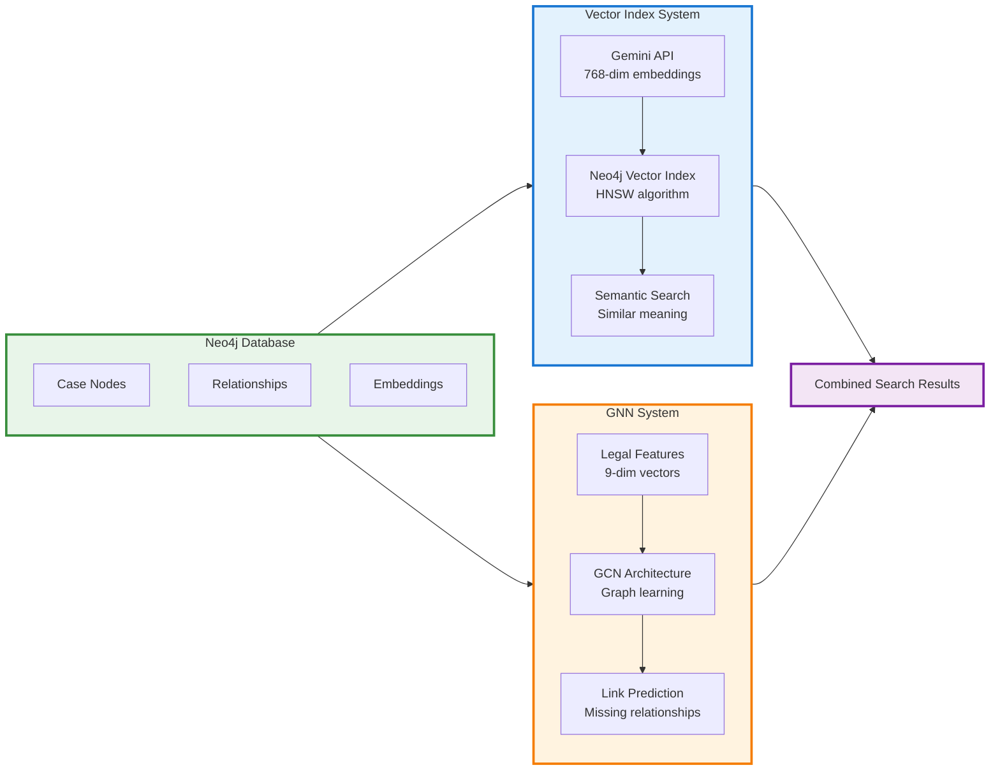
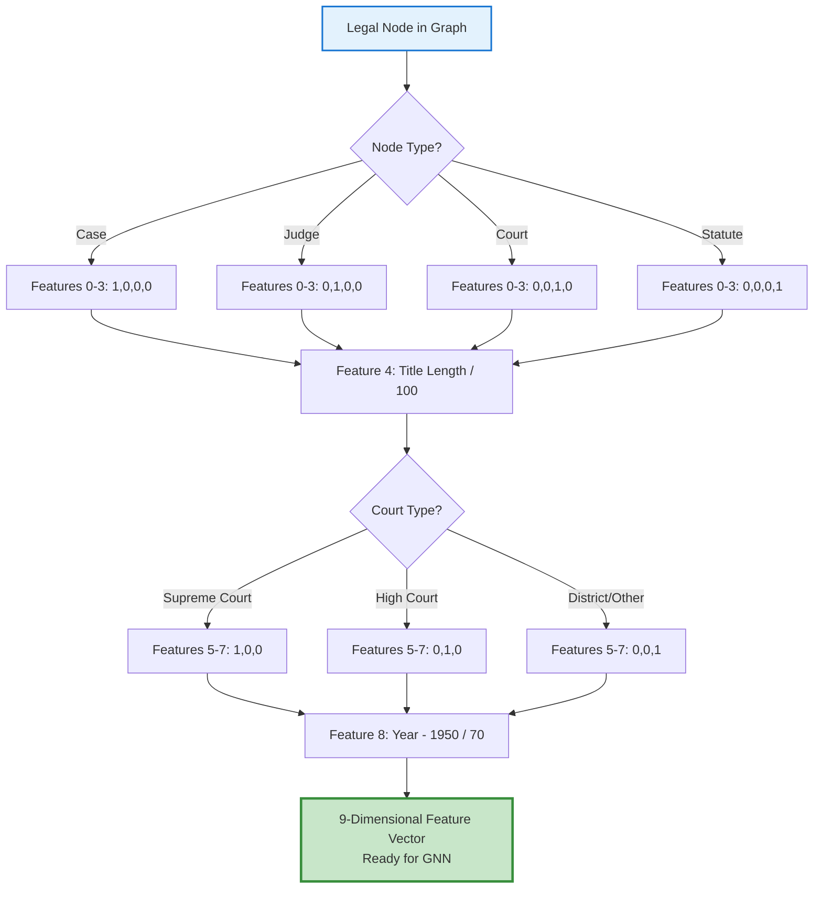
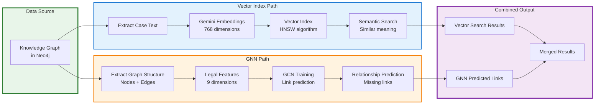
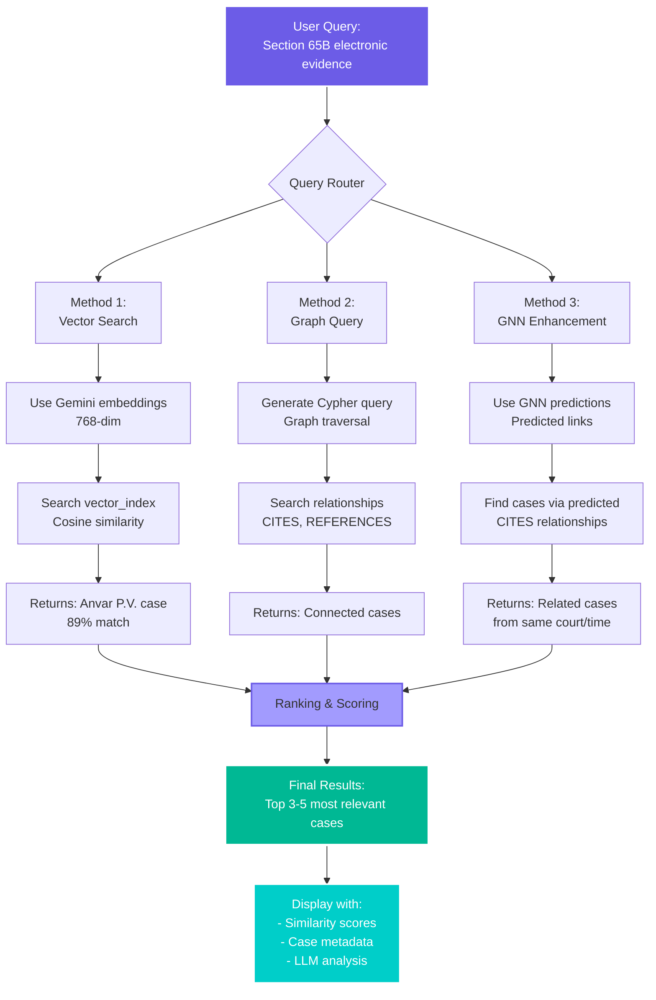

# GNN Integration Flow - Mermaid Diagrams

## Complete System Integration

```mermaid
flowchart TD
    Start([Start: Legal Documents]) --> Load[Load Legal Documents<br/>JSON files + CSV data]
    
    Load --> CreateNodes[Create Nodes in Neo4j]
    CreateNodes --> CaseNode[Case nodes<br/>id, title, court, date, text]
    CreateNodes --> JudgeNode[Judge nodes<br/>name]
    CreateNodes --> CourtNode[Court nodes<br/>name]
    CreateNodes --> StatuteNode[Statute nodes<br/>name]
    
    CaseNode --> CreateRel[Create Relationships]
    JudgeNode --> CreateRel
    CourtNode --> CreateRel
    StatuteNode --> CreateRel
    
    CreateRel --> JudgedRel[Judge -JUDGED→ Case]
    CreateRel --> HeardRel[Case -HEARD_BY→ Court]
    CreateRel --> RefRel[Case -REFERENCES→ Statute]
    
    JudgedRel --> GenEmbed[Generate Embeddings<br/>Gemini API]
    HeardRel --> GenEmbed
    RefRel --> GenEmbed
    
    GenEmbed --> VectorEmbed[Convert text → 768-dim vectors<br/>Store in Case.embedding]
    VectorEmbed --> CreateIndex[Create Vector Index<br/>vector_index + entity_index]
    
    CreateIndex --> Neo4jGraph[(Neo4j Knowledge Graph<br/>Nodes + Relationships + Indexes)]
    
    Neo4jGraph --> GNNExtract[GNN: Extract Graph Data]
    Neo4jGraph --> VectorSearch[Vector Index Search]
    
    GNNExtract --> Query1[Query 1: Get all nodes<br/>MATCH n RETURN id, labels, properties]
    GNNExtract --> Query2[Query 2: Get all relationships<br/>MATCH source-r→target]
    
    Query1 --> CreateFeatures[Create Features<br/>9-dim vectors per node]
    Query2 --> EdgeIndex[Create edge_index<br/>source→target pairs]
    
    CreateFeatures --> GNNTrain[GNN Training]
    EdgeIndex --> GNNTrain
    
    GNNTrain --> FeatureEng[Feature Engineering 9-dim]
    FeatureEng --> GCN1[GCN Layer 1: 9→64]
    GCN1 --> ReLU1[ReLU + Dropout 0.5]
    ReLU1 --> GCN2[GCN Layer 2: 64→64]
    GCN2 --> LinkHead[Link Prediction Head<br/>Concatenate + Dense layers]
    LinkHead --> TrainResult[Training Result<br/>ROC-AUC: 0.78-0.85]
    
    TrainResult --> Predictions[GNN Predictions]
    Predictions --> Pred1[Case_123 -CITES→ Case_456<br/>89% probability]
    Predictions --> Pred2[Case_789 -REFERENCES→ Statute_X<br/>92% probability]
    Predictions --> Pred3[Judge_Y -JUDGED→ Case_321<br/>85% probability]
    
    Pred1 --> Integration[Integration with Search]
    Pred2 --> Integration
    Pred3 --> Integration
    VectorSearch --> Integration
    
    Integration --> UserQuery[User Query:<br/>Section 65B electronic evidence]
    UserQuery --> VectorStep[Step 1: Vector Index Search<br/>Gemini 768-dim embeddings]
    UserQuery --> GNNStep[Step 2: GNN Enhancement<br/>Predicted relationships]
    
    VectorStep --> CombineResults[Combined Results]
    GNNStep --> CombineResults
    
    CombineResults --> FinalResult[Direct matches Vector<br/>+ Related cases GNN<br/>+ Graph relationships]
    
    style Neo4jGraph fill:#E6F3FF,stroke:#2E86AB,stroke-width:3px
    style GNNTrain fill:#FFF4E6,stroke:#F77F00,stroke-width:3px
    style Predictions fill:#E6FFE6,stroke:#06A77D,stroke-width:3px
    style Integration fill:#F0E6FF,stroke:#6C5CE7,stroke-width:3px
    style FinalResult fill:#D4EDDA,stroke:#28A745,stroke-width:3px
```



---

## Simplified GNN Architecture Flow

```mermaid
graph TB
    subgraph Input["INPUT LAYER"]
        Graph[Legal Case Graph<br/>Cases, Judges, Courts, Statutes]
    end
    
    subgraph Features["FEATURE ENGINEERING"]
        F1[Node Type: Case/Judge/Court/Statute<br/>4 features: one-hot encoded]
        F2[Title Length: normalized<br/>1 feature]
        F3[Court Hierarchy: SC/HC/District<br/>3 features: one-hot encoded]
        F4[Year: 1950-2020 normalized<br/>1 feature]
        F5[Total: 9-dimensional vector]
    end
    
    subgraph GNN["GNN ARCHITECTURE"]
        GCN1[GCN Layer 1<br/>Input: 9-dim → Output: 64-dim<br/>Aggregates neighbor info]
        Activation1[ReLU Activation<br/>max0, x<br/>+ Dropout 0.5]
        GCN2[GCN Layer 2<br/>Input: 64-dim → Output: 64-dim<br/>Higher-level patterns]
    end
    
    subgraph Prediction["LINK PREDICTION"]
        Concat[Concatenate Embeddings<br/>Source 64 + Target 64 = 128]
        Dense1[Dense Layer: 128 → 64<br/>+ ReLU + Dropout]
        Dense2[Dense Layer: 64 → 1<br/>+ Sigmoid]
        Output[Probability: 0.0 to 1.0<br/>Relationship likelihood]
    end
    
    Graph --> F1
    Graph --> F2
    Graph --> F3
    Graph --> F4
    F1 --> F5
    F2 --> F5
    F3 --> F5
    F4 --> F5
    
    F5 --> GCN1
    GCN1 --> Activation1
    Activation1 --> GCN2
    GCN2 --> Concat
    Concat --> Dense1
    Dense1 --> Dense2
    Dense2 --> Output
    
    style Graph fill:#E3F2FD,stroke:#1976D2,stroke-width:2px
    style F5 fill:#FFF9C4,stroke:#F57C00,stroke-width:2px
    style GCN2 fill:#C8E6C9,stroke:#388E3C,stroke-width:2px
    style Output fill:#FFCDD2,stroke:#D32F2F,stroke-width:2px
```



---

## Data Flow: Graph → GNN → Predictions

```mermaid
sequenceDiagram
    participant KG as Knowledge Graph (kg.py)
    participant Neo4j as Neo4j Database
    participant GNN as GNN System
    participant Model as GNN Model
    participant Results as Search Results
    
    Note over KG: Phase 1: Graph Creation
    KG->>Neo4j: Create Case nodes (text, court, date)
    KG->>Neo4j: Create Judge/Court/Statute nodes
    KG->>Neo4j: Create relationships (JUDGED, HEARD_BY)
    KG->>Neo4j: Generate Gemini embeddings (768-dim)
    KG->>Neo4j: Create vector_index + entity_index
    
    Note over Neo4j: Data Storage Complete
    
    Note over GNN: Phase 2: GNN Extraction
    GNN->>Neo4j: MATCH (n) RETURN nodes
    Neo4j-->>GNN: All nodes (Case, Judge, Court, Statute)
    GNN->>Neo4j: MATCH ()-[r]->() RETURN relationships
    Neo4j-->>GNN: All edges (JUDGED, HEARD_BY, REFERENCES)
    
    Note over GNN: Phase 3: Feature Engineering
    GNN->>GNN: Create 9-dim features<br/>(type, court, year)
    GNN->>GNN: Create edge_index tensor
    
    Note over Model: Phase 4: GNN Training
    GNN->>Model: Train on graph structure
    Model->>Model: GCN Layer 1 (9→64)
    Model->>Model: ReLU + Dropout
    Model->>Model: GCN Layer 2 (64→64)
    Model->>Model: Link Prediction Head
    Model-->>GNN: Trained model (ROC-AUC: 0.78-0.85)
    
    Note over GNN: Phase 5: Make Predictions
    GNN->>Model: Predict missing links
    Model-->>GNN: Predicted relationships<br/>(with probabilities)
    GNN->>Neo4j: (Optional) Add predictions to graph
    
    Note over Results: Phase 6: Integrated Search
    Results->>Neo4j: Vector search (Gemini 768-dim)
    Results->>Neo4j: Graph query (relationships)
    Results->>Model: GNN enhancement (predictions)
    Neo4j-->>Results: Similar cases
    Model-->>Results: Related cases
    Results-->>Results: Combine all results
```



---

## Vector Index vs GNN Comparison



---

## Feature Engineering Detail



---

## GNN Prediction Process

```mermaid
stateDiagram-v2
    [*] --> ExtractGraph: Start GNN Process
    
    state "Extract from Neo4j" as ExtractGraph {
        [*] --> GetNodes: MATCH (n) RETURN nodes
        GetNodes --> GetEdges: MATCH ()-[r]->() RETURN edges
        GetEdges --> [*]: Return graph data
    }
    
    ExtractGraph --> CreateFeatures: Convert to tensors
    
    state "Feature Engineering" as CreateFeatures {
        [*] --> NodeType: Encode node type (4 dims)
        NodeType --> TitleLen: Add title length (1 dim)
        TitleLen --> CourtHier: Add court hierarchy (3 dims)
        CourtHier --> YearInfo: Add year (1 dim)
        YearInfo --> [*]: 9-dim vector ready
    }
    
    CreateFeatures --> TrainGNN: Feed to GNN
    
    state "GNN Training" as TrainGNN {
        [*] --> GCN1: GCN Layer 1 (9→64)
        GCN1 --> ReLU: ReLU + Dropout 0.5
        ReLU --> GCN2: GCN Layer 2 (64→64)
        GCN2 --> LinkPred: Link Prediction Head
        LinkPred --> Sigmoid: Sigmoid (0-1 prob)
        Sigmoid --> [*]: Trained model
    }
    
    TrainGNN --> MakePredictions: Predict links
    
    state "Generate Predictions" as MakePredictions {
        [*] --> Sample: Sample candidate node pairs
        Sample --> Predict: Run through trained model
        Predict --> Rank: Rank by probability
        Rank --> TopK: Select top-k predictions
        TopK --> [*]: Return predictions
    }
    
    MakePredictions --> [*]: Output: Predicted relationships
```



---

## Parallel Systems: Vector Index + GNN



---

## Search Integration Flow



---

## How GNN Enhances Vector Search

```mermaid
graph TB
    Start[User searches:<br/>Section 65B evidence] --> VectorSearch[Vector Index finds:<br/>Anvar P.V. case 89%]
    
    VectorSearch --> GNNCheck{GNN trained?}
    
    GNNCheck -->|Yes| GNNQuery[Query GNN for predictions:<br/>What cases cite Anvar P.V.?]
    GNNCheck -->|No| DirectResult[Return vector results only]
    
    GNNQuery --> GNNPredict[GNN predictions:<br/>Case_45 -CITES→ Anvar 92%<br/>Case_78 -CITES→ Anvar 87%<br/>Case_123 -CITES→ Anvar 85%]
    
    GNNPredict --> Enrich[Enrich results with:<br/>+ Predicted citing cases<br/>+ Related precedents<br/>+ Court network analysis]
    
    Enrich --> EnrichedResult[Enhanced Results:<br/>Direct match + Related cases]
    
    DirectResult --> FinalMerge[Merge Results]
    EnrichedResult --> FinalMerge
    
    FinalMerge --> UserDisplay[Display to User]
    
    style Start fill:#6C5CE7,color:#fff,stroke:#fff,stroke-width:2px
    style GNNPredict fill:#FFF3E0,stroke:#F57C00,stroke-width:2px
    style EnrichedResult fill:#C8E6C9,stroke:#388E3C,stroke-width:2px
    style UserDisplay fill:#00B894,color:#fff,stroke:#fff,stroke-width:3px
```



---

## Usage Instructions

### To view these diagrams:

1. **Copy the Mermaid code** from any section above

2. **Paste into one of these tools:**
   - GitHub/GitLab markdown (renders automatically)
   - [Mermaid Live Editor](https://mermaid.live)
   - VS Code with Mermaid extension
   - Notion (supports Mermaid)

3. **Or include in markdown files:**
   ```markdown
   ```mermaid
   [paste code here]
   ```
   ```

---

## All Diagrams Included:

1. ✅ **Complete System Integration** - Full 5-phase flow
2. ✅ **Simplified GNN Architecture** - Layer-by-layer breakdown
3. ✅ **Data Flow Sequence** - Step-by-step process
4. ✅ **Parallel Systems** - Vector Index vs GNN
5. ✅ **Search Integration** - Query routing and ranking
6. ✅ **GNN Enhancement** - How GNN improves vector search

---

**Copy any section and paste into GitHub README or Mermaid Live Editor!** 🚀

