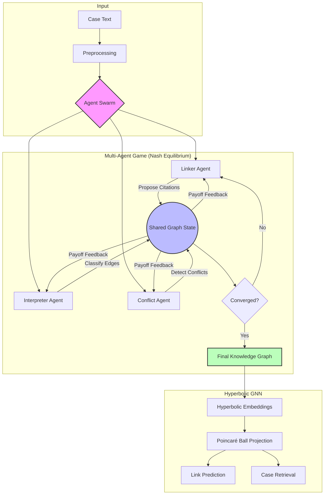
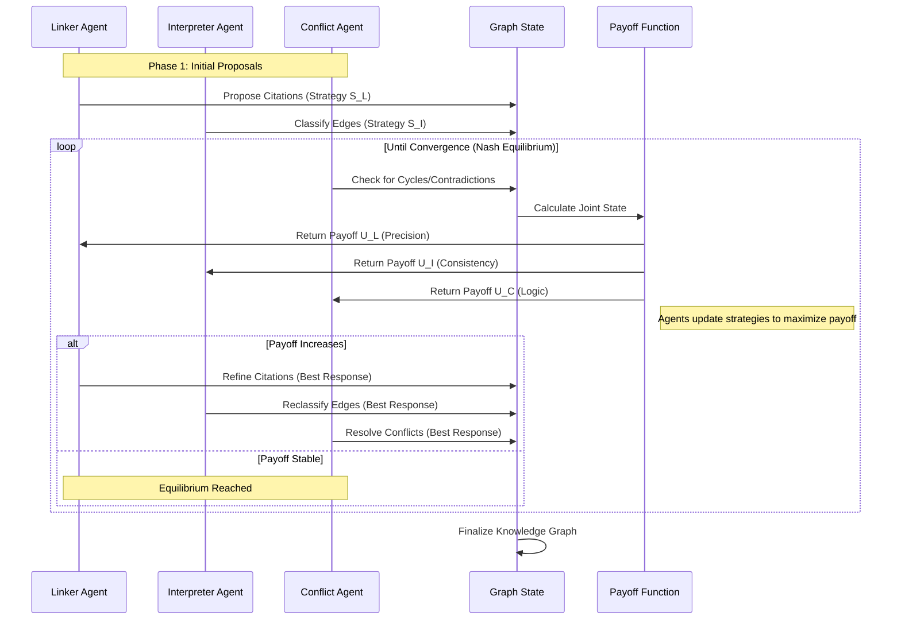

# System Architecture & Sequence Diagrams

## 1. System Architecture Flowchart



## 2. Nash Equilibrium Sequence Diagram



## 3. Hyperbolic Embedding Process

```mermaid
graph LR
    A[Legal Case Node] --> B[Feature Extraction]
    B --> C[GNN Layer 1]
    C --> D[ReLU Activation]
    D --> E[GNN Layer 2]
    E --> F[Exponential Map (Exp_x)]
    F --> G((Poincaré Ball))
    
    subgraph "Euclidean Space"
    B
    C
    D
    E
    end
    
    subgraph "Hyperbolic Space"
    G
    end
    
    style G fill:#ff9,stroke:#333,stroke-width:2px
```
